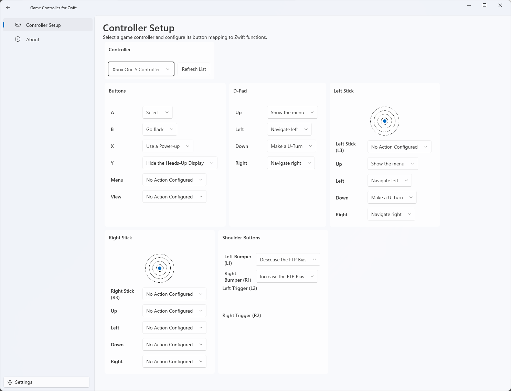
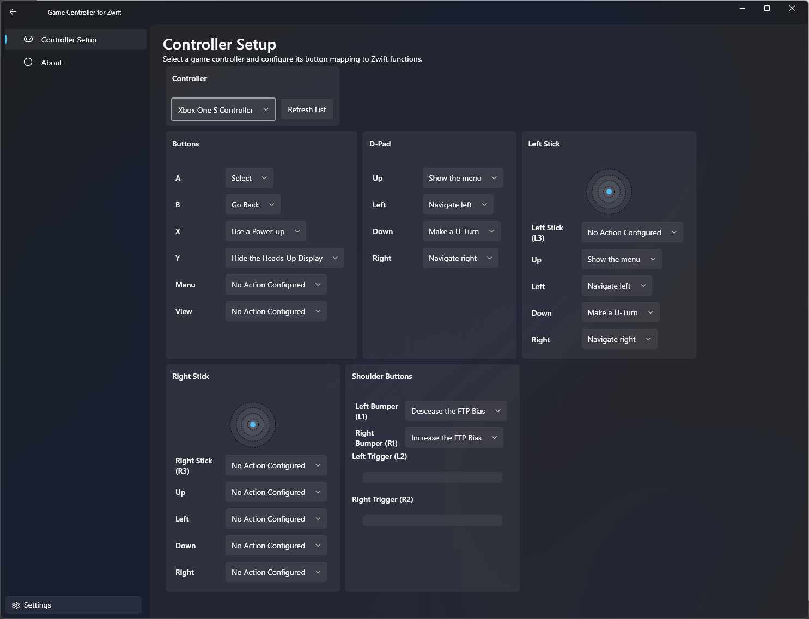

  

<h1 align="center">
  Game Controller For Zwift
</h1>

  A way to levarge your existing video game controllers with Zwift. Reduce electronic waste with this Windows application that runs locally on your Windows computer.

  
  &nbsp;
 
  &nbsp;
  

## Introduction

This project enables using standard video game controllers to interact with Zwift. The long-term goal is to replicate the flexibility and functionality of Zwift-compatible controllers like the [Zwift Play Controllers](https://us.zwift.com/products/zwift-play?variant=43737779896576) or the [Wahoo Kickr Bike Shift](https://www.wahoofitness.com/devices/indoor-cycling/smart-bikes/kickr-bike-shift-buy). You can use controllers like Nintendo Switch Joy-Cons, Xbox Controllers, and other popular game controllers you already own.

Game Controller for Zwift typically only lets you use one controller at a time, will interpret a pair of connected Joy-Cons as a single controller.

  

## Getting start with the app

1. Download the latest [release](https://github.com/VoltageSolutions/GameControllerForZwift/releases), available as a `.zip` archive.
1. Unpack the archive and run the application on the same Windows computer you will use to run Zwift.
    1. If you do not have the .NET 9 Runtime installed, the app will prompt you to download it.
1. Run `GameControllerForZwift.exe`.
1. This app is not currently digitally signed. Microsoft Defender SmartScreen might block it. If so, click **More info** and then **Run anyway**. The app will start.
1. GameControllerForZwift will attempt to link up to a game controller connected to your PC. If you didn't already do so, connect a controller to Windows and Refresh to select it from the list of options.
1. Configure your controller buttons to control Zwift as you'd like. Switch to Zwift and Ride On!

  

    
    
Application in Light Mode

  

  

    
    
Application in Dark Mode

  

## Building from source

1. Setup the .NET 9 SDK and Desktop Development with WPF on your machine (such as with Visual Studio 2022).
1. Clone the repo.
1. Build the solution.

## How to contribute

### Ideas, Issues, or Bugs

Post to the [Issues page](https://github.com/VoltageSolutions/GameControllerForZwift/issues).

### Code

This project follows a modified version of Git Flow where `main` always represents the latest version. Submit a PR - if I approve it, I will merge to a version branch for testing prior to merging to `main` and creating a new release.

### Donate

Support this project on [ko-fi](https://ko-fi.com/voltagesolutions)!

## Roadmap

### Coming soon

- Improved code readability and maintainability.
- Improved code coverage.
- User-configurable threshold/deadzone thumbsticks to reduce accidental inputs.
- App icons and graphics.
- Combine `Core` and `Logic` projects together.
- Save and reload custom button-mapping configuration profiles.
- Log to a text file for easy debugging support.

### Long-term stretch goals

- Use Bluetooth or WiFi to integrate with Zwift on the Device Pairing screen.
- Steering and braking support.
  - This would make it possible to do something useful with the analog inputs like thumbsticks and triggers.
- Enable switching mapping profiles on-the-fly.
- Navigate Windows with profiles to help bridge any usage gaps.

### Ultra long-term goals

macOS and Linux support.

## Known Bugs and Issues

- Navigation within GameControllerForZwift is flaky. I've disabled the backstack until I can work it out.
- The trigger gauges do not show up well in light mode when not in use - it may look like they aren't there at all.
- Windows 10 issues
  - Clicking around the app can highlight the entire window.
  - Dark-mode does not apply the intended color selections correctly.

## Technical Details

Please visit our [GitHub Pages site](https://VoltageSolutions.github.io/GameControllerForZwift) for more details.
