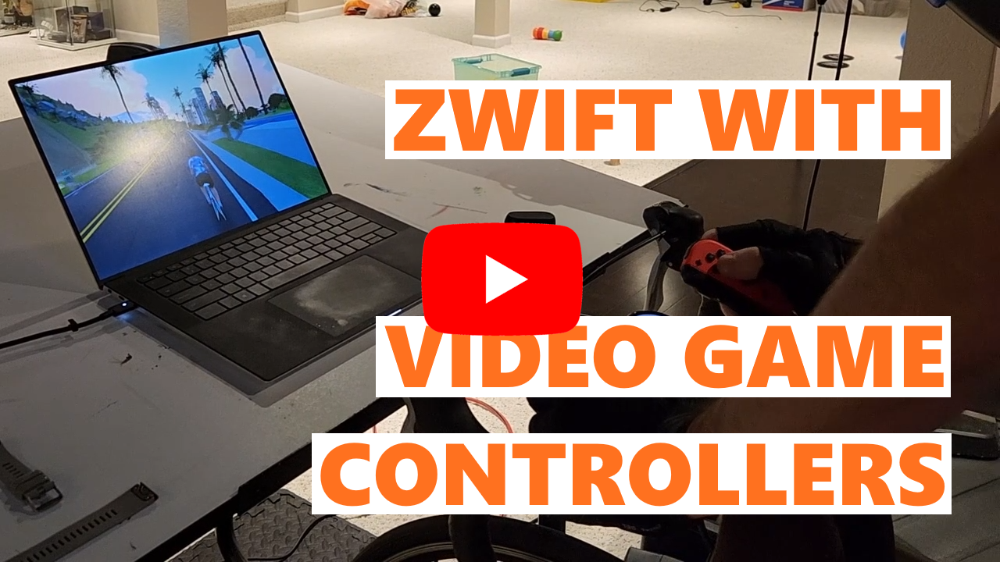

  

<h1 align="center">
  GameControllerForZwift
</h1>

  Use your existing Game Controllers with Zwift

## Introduction

This project enables using standard video game controllers to interact with Zwift. The long-term goal is to replicate the flexibility and functionality of Zwift-compatible controllers like the [Zwift Play Controllers](https://us.zwift.com/products/zwift-play?variant=43737779896576) or the [Wahoo Kickr Bike Shift](https://www.wahoofitness.com/devices/indoor-cycling/smart-bikes/kickr-bike-shift-buy).

## Getting start with the app

1. Download the latest release, available as a `.zip` archive.
1. Unpack the archive and run the application on the same Windows computer you will use to run Zwift.
    1. If you do not the .NET 9 Runtime installed, the app will prompt you to download it.
1. GameControllerForZwift will attempt to link up to a game controller connected to your PC. If you didn't already do so, connect a controller and Refresh to select it from the list of options.
1. Configure your controller buttons to control Zwift as you'd like. Switch to Zwift and Ride On!

## Building from source

1. Setup the .NET 9 SDK and Desktop Development with WPF on your machine (such as with Visual Studio 2022).
1. Clone the repo.
1. Build the solution.

## How to contribute

### Ideas, Issues, or Bugs

Post to the [Issues page](https://github.com/VoltageSolutions/GameControllerForZwift/issues).

### Code

This project follows a modified version of Git Flow where `main` always represents the latest version. Submit a PR - if I approve it, I will merge to a version branch for testing prior to merging to `main` and creating a new release.

### Donate

Support this project on [ko-fi](https://ko-fi.com/waveguide)!

## Roadmap

### Coming soon

- Improved code readability and maintainability.
- Improved code coverage.
- User-configurable threshold/deadzone thumbsticks to reduce accidental inputs.
- App icons and graphics.
- Combine `Core` and `Logic` projects together.
- Save and reload custom button-mapping configuration profiles.
- Log to a text file for easy debugging support.

### Long-term stretch goals

- Use Bluetooth or WiFi to integrate with Zwift on the Device Pairing screen.
- Steering and braking support.
  - This would make it possible to do something useful with the analog inputs like thumbsticks and triggers.
- Enable switching mapping profiles on-the-fly.
- Navigate Windows with profiles to help bridge any usage gaps.

### Ultra long-term goals

macOS and Linux support.

## Known Bugs and Issues

- "Down arrow" navigates down in the UI properly but does not initiate a U-turn as it should - you have to use the menu to U-turn instead.
  - The current implementation uses a `KeyPress` instead of holding a `KeyDown`. We need to build functionality to permit holding a controller button as a continuous `KeyDown` action followed by a `KeyUp`.
- Navigation within GameControllerForZwift is flaky. I've disabled the backstack until I can work it out.
- The trigger gauges do not show up when not in use - it may look like they aren't there at all.
- Windows 10 issues
  - Clicking around the app can highlight the entire window.
  - Dark-mode does not apply the intended color selections correctly.

## Project Organization

This project's organization loosely follows a Clean Architecture Layout.

### Domain

`GameControllerForZwift.Core` defines base entities and interfaces for the other projects to use.

### Application

`GameControllerForZwift.Logic` is the main functionality of the application. This has turned out to be simple enough that I will combine the Domain and Application projects in the future.

### Infrastructure

`GameControllerForZwift.Gamepad` leverages SDL2 to capture game controller input.

`GameControllerForZwift.Keyboard` translate Zwift functions to key-presses that Zwift understands. The goal in the future is to augment or replace this implementation with a Bluetooth or WiFi compatible option instead.

### Presentation

`GameControllerForZwift.UI.WPF` contains ViewModels and any custom controls.

`GameControllerForZwift.WPF` is a WPF executable application.
